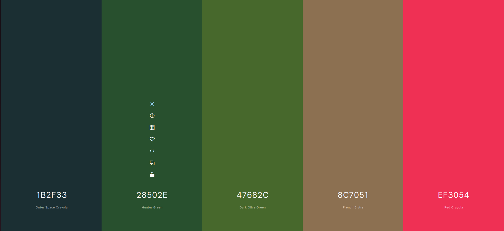

# CSS Planning (subject to change)
## Header font
'Montserrat Subrayada', sans-serif

## Body font 
'Robot', sans-serif

## Colors Pallette
- Outer Space Crayola (#1B2F33)
- Hunter Green (#28502E)
- Dark Olive-Green (#47682C)
- French Bistre (#8C7051)
- Red Crayola (#EF3054)

## CSS Classes 

**class="headers"**  
h1, h2, h3  
Font: "header font" (refer to above)  
Font-Color: Hunter Green

**class="navigation"**  
ul / li navigation bar  
Font: "body font" (refer to above)  
Font-Color: White
Active underline: 
Background-color: French Bistre

**class="content"**  
p  
Font: "body font" (refer to above)  
Font-color: Dark Olive-Green 
**class="user-form"**   
form/fieldset   
Font: "body font" (refer to above)  
Font-color: Dark Olive-green

**class="resource-list"**   
ul / li resources page  
Font: "body font" (refer to above)  
Font-color: Dark Olive-green

**class="gallery-caption"**  
figcaption   
Font: "body font" (refer to above)
Background-Color: French Bistre

